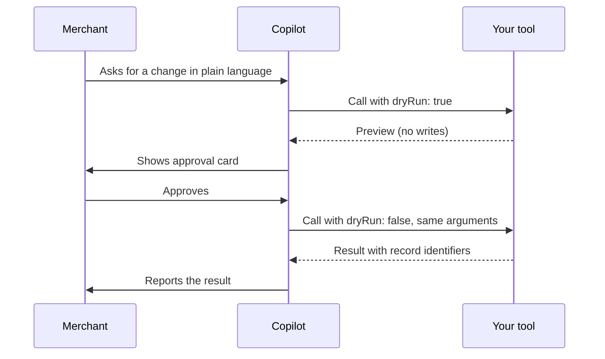

---
nav:
  title: Copilot tool approval
  position: 40

---

# Making Your MCP Tools Work With Shopware Copilot

Shopware Copilot can use the MCP tools that your plugin or app registers on a merchant's shop. This guide explains how Copilot discovers those tools and describes the `dryRun` contract a tool must follow so that the merchant gets an approval step before the tool changes data.

::: info
This functionality is available starting with Shopware 6.7.14.0, which provides the tool groups and progressive discovery used by this guide. The MCP server is experimental.
:::

::: warning
The `dryRun` contract is a temporary solution. A future Shopware release is expected to replace it with standard MCP tool annotations. Treat this guide as a workaround until the stable solution is in place.
:::

## Prerequisites

This guide assumes that you know how to extend the Shopware MCP server. For more information, see [MCP Support in Shopware](./index.md).

You need the following:

* A Shopware 6.7 installation with the MCP server enabled
* A plugin or app that registers at least one MCP tool
* Access to Shopware Copilot in the Administration

## Summary

You don't need to register your tools with Copilot. Copilot finds them through the shop's own MCP catalog.

Copilot decides how to call a tool by inspecting its input schema:

* A tool whose schema declares a boolean `dryRun` parameter is treated as a tool that changes data. Copilot first calls it with `dryRun: true` to obtain a preview, shows the merchant an approval card in the UI, and calls it with `dryRun: false` only after the merchant approves.
* A tool without `dryRun` is treated as read-only and is called directly, even if the tool performs write operations.

If your tool has side effects, declare `dryRun`. This is the whole contract.

## How Copilot uses your tools

Copilot connects to the shop's MCP endpoint with the merchant's permissions. Your tools aren't visible to the AI model by default. Shopware groups tools into toolsets using the group you declare, and Copilot enables a toolset only when the conversation needs it.

Two things matter for your tool to be picked at all:

* **Tool description** - Copilot searches descriptions to find a matching tool. Write the description for a reader who doesn't know your extension: what the tool does, when to use it, and what it returns.
* **Group name** - Tools that share a `McpToolGroup` become one toolset. Use a short, stable, product-specific name such as `b2b-quotes` rather than a generic one like `tools`.

Once a toolset is enabled, Copilot calls your tool through its gateway. The gateway validates the call, applies the approval rules described below, and forwards the call to the shop. Your tool runs inside Shopware exactly as it does for any other MCP client.

## The contract

The contract consists of four rules.

### R1 - Declare dryRun on tools with side effects

A tool that creates, updates, deletes, or otherwise changes shop data must declare a boolean input parameter named `dryRun` with a default of `true`. The name is case-sensitive and must appear as a top-level property in the tool's input schema.

### R2 - Preview without changing anything

When called with `dryRun: true`, the tool must not change anything. It validates the arguments completely and returns a preview that describes what the real call does. The preview is what the merchant sees on the approval card in the Copilot chat.

If validation fails, return an error at this stage. The merchant is then never asked to approve a change that can't run.

### R3 - Commit from the arguments alone

When called with `dryRun: false`, the tool performs the change and returns the result, including the identifiers of created or modified records. The commit call arrives with the same arguments as the preview call, apart from `dryRun`. Don't depend on any state from the preview call.

### R4 - Keep read-only tools free of dryRun

A tool that only reads data must not declare `dryRun`. Copilot calls such tools directly while answering a question. Adding `dryRun` to a read tool forces an unnecessary approval step and confuses the model.

::: danger
A tool with side effects but without a `dryRun` parameter is indistinguishable from a read tool. Copilot calls it directly, without showing the merchant an approval card. Review every tool you publish against rule R1 before release.
:::

### Behavior matrix

The following table summarizes how Copilot treats each tool shape:

| Tool shape                        | How Copilot calls it                         | Merchant approval |
| :-------------------------------- | :------------------------------------------- | :---------------- |
| No `dryRun` in schema             | Directly, during the conversation            | Not shown         |
| Has `dryRun`, called with `true`  | Directly, to obtain the preview              | Not needed        |
| Has `dryRun`, called with `false` | Only after the merchant approves the preview | Required          |
| Has side effects, no `dryRun`     | Directly, treated as read-only               | Bypassed          |

## What the merchant sees

A change request passes through three steps:

1. **Preview** - Copilot calls your tool with `dryRun: true`. Your tool validates the request and returns a description of the intended change. Nothing is written.
2. **Approval** - Copilot renders your preview as a change request in the Administration. The merchant approves or rejects it.
3. **Commit** - Copilot calls your tool with `dryRun: false` and the same arguments as in the first step. Your tool performs the change and returns the result, which Copilot reports back to the merchant.

The following diagram shows the flow between the merchant, Copilot, and your tool:



The preview and commit steps happen in separate MCP sessions, possibly minutes apart. Copilot re-enables your toolset before the commit call. Your tool must compute everything it needs from the arguments alone.

## Implement a write tool in a plugin

The example below is a complete write tool for a plugin. It extends `McpToolResponse` to use Shopware's standard response envelope and helpers, and follows rules R1 to R3.

```PHP
<?php declare(strict_types=1);

namespace Vendor\MyExtension\Mcp\Tool;

use Mcp\Capability\Attribute\McpTool;
use Shopware\Core\Framework\Mcp\Attribute\McpToolGroup;
use Shopware\Core\Framework\Mcp\Attribute\McpToolRequires;
use Shopware\Core\Framework\Mcp\Context\McpContextProvider;
use Shopware\Core\Framework\Mcp\Tool\McpToolResponse;

#[McpTool(
    name: 'myext-promotion-pause',
    title: 'Pause Promotion',
    description: 'Pause an active promotion so it stops applying to new orders. '
        . 'Use dryRun=true (default) to preview which promotion would be paused; '
        . 'set dryRun=false only to execute an approved change. Returns the promotion ID and new state.'
)]
#[McpToolGroup('myext-promotions')]
#[McpToolRequires('promotion:update')]
final class PromotionPauseTool extends McpToolResponse
{
    public function __construct(
        private readonly PromotionService $promotions,
        private readonly McpContextProvider $contextProvider,
    ) {
    }

    public function __invoke(string $promotionId, bool $dryRun = true): string
    {
        $context = $this->contextProvider->getContext();

        if ($error = $this->requirePrivilege($context, 'promotion:update')) {
            return $error;
        }

        $promotion = $this->promotions->find($promotionId, $context);

        if ($promotion === null) {
            return $this->error('Promotion not found.');
        }

        if (!$promotion->isActive()) {
            return $this->error('Promotion is already paused.');
        }

        if ($dryRun) {
            // R2: full validation done above, no writes here.
            return $this->success([
                'promotionId' => $promotion->getId(),
                'name'        => $promotion->getName(),
                'change'      => ['active' => ['from' => true, 'to' => false]],
            ], ['dryRun' => true]);
        }

        // R3: the approved commit.
        $this->promotions->pause($promotion->getId(), $context);

        return $this->success([
            'promotionId' => $promotion->getId(),
            'active'      => false,
        ]);
    }
}
```

Register the class as a service tagged `shopware.mcp.tool`. Shopware derives the input schema from the `__invoke()` signature, so the `bool $dryRun = true` parameter is all that is needed to satisfy rule R1.

```PHP
// Resources/config/services.php
$services->set(PromotionPauseTool::class)
    ->args([
        service(PromotionService::class),
        service(McpContextProvider::class),
    ])
    ->tag('shopware.mcp.tool');
```

### Write the preview

The preview payload is rendered to the merchant, so shape it for a person rather than for a machine:

* Name the affected records by something the merchant recognizes, such as a product number or promotion name, alongside the technical ID.
* Describe the change as *from* and *to* values where possible.
* Keep it small. Summarize bulk operations with counts and a few examples instead of listing every record.
* Return `error()` for anything the commit would reject. A preview that succeeds and a commit that fails is the worst experience for the merchant.

### Read-only tools

A read tool has the same class shape without the `dryRun` parameter. Declare the read privilege it needs and return the data directly. Don't add a `dryRun` parameter to a tool that has no side effects.

### App-based tools

Tools that an app exposes over a webhook follow the same contract. Declare `dryRun` as an optional boolean property with `"default": true` in the tool's JSON input schema. Because JSON Schema defaults do not populate omitted request properties, the webhook handler must treat a missing value as `true` (for example, `$dryRun = $args['dryRun'] ?? true`) before branching.

## Requirements and limits

* **Stateless between calls** - Preview and commit arrive in different sessions. Never store the preview and replay it on commit. Recompute from the arguments.
* **Idempotent commits where possible** - Copilot executes an approval once, but network retries can repeat a call. Design the commit so that running it twice with the same arguments is harmless.
* **Privileges are the merchant's** - Copilot acts with the permissions of the merchant who is chatting. Check the privilege your change needs with `requirePrivilege()` and declare it with `McpToolRequires` so that shop administrators can configure roles.
* **Response envelope** - Always return through `success()` or `error()`. Copilot treats `success: false` as a tool error and doesn't proceed to the commit.
* **Response size** - Responses larger than 100 KB are returned through a resource URI instead of inline. Keep previews and results compact, so Copilot can use them directly.
* **Timeouts** - Copilot waits a few seconds for a tool call. Long-running work should return quickly and continue asynchronously, reporting a reference the merchant can check.
* **No preview-only side effects** - Logging is fine. Creating draft records, reserving stock, or sending notifications during a preview is not.

## Test your tool

Follow these steps to verify that Copilot discovers and calls your tool correctly:

1. Confirm that your tool is registered. The following command lists your tool with its group and privileges:

    ```bash
    bin/console debug:mcp
    ```

2. Call the shop's MCP endpoint directly with an Admin API token. Enable your toolset with `shopware-toolset-enable`, call the tool with `dryRun: true`, and check that nothing changed. Then call it with `dryRun: false` and verify the change.

3. In the Copilot chat, ask for the change in plain language. Copilot should search for your tool, show an approval card with your preview, and apply the change after approval.

4. Ask Copilot to do something your validation rejects. The failure should surface at the preview stage, before any approval card appears.

::: tip
To trace what Copilot does, inject a logger into the tool and log every invocation with the `dryRun` value. Tool classes that extend `McpToolResponse` are already attached to the `mcp` Monolog channel. A `dryRun: true` entry in the log proves that Copilot found the tool, enabled its toolset, and called it.
:::

## Known limitations

The `dryRun` contract is Copilot's first mechanism for safely running tools it hasn't seen before. It has two known gaps:

* Tools that change data but can't offer a meaningful preview, such as file uploads, cannot use this approval flow. If published without `dryRun`, they are treated as read-only and may execute immediately without merchant approval, so expose them only when that behavior is acceptable.
* The contract relies on a naming convention. A future Shopware release is expected to expose the standard MCP tool annotations, including `readOnlyHint`, and Copilot honors those when present. Declaring `dryRun` remains supported, so tools written against this guide don't need changes.

## Checklist before you publish

* Every tool with side effects declares `bool $dryRun = true`.
* No read-only tool declares `dryRun`.
* Preview calls validate fully and write nothing.
* Commit calls work from the arguments alone and are safe to repeat.
* Descriptions explain when to use the tool and mention the `dryRun` behavior.
* Privileges are declared and checked.

Now that your tools follow the approval contract, see [MCP Support in Shopware](../index.md) for the full list of tool, resource, and prompt extension points the MCP server offers.
