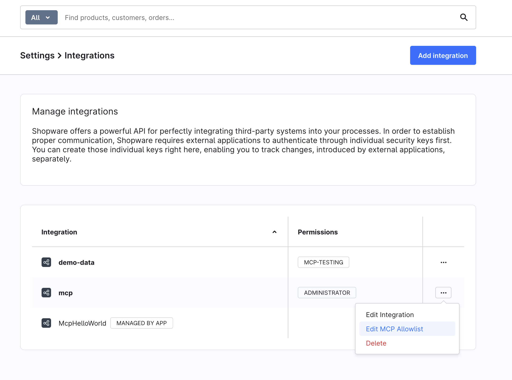

---
nav:
  title: Getting Started
  position: 20

---

# Getting Started

This guide walks you through connecting an AI client to a Shopware shop using the built-in MCP server.

## Prerequisites

- Shopware 6.7 or later
- `symfony/mcp-bundle` installed — verify with `composer show symfony/mcp-bundle`. If it is missing, ensure it is listed as a dependency in `composer.json` and run `composer install`.
- The `MCP_SERVER` feature flag enabled (see [Configuration](./configuration.md))

## Step 1: Enable the feature flag

Add the following to your `.env` file:

```bash
MCP_SERVER=1
```

This activates the MCP endpoint at `/api/_mcp` and registers all tools, resources, and prompts.

## Step 2: Create an integration

Create a Shopware integration for the MCP client. The integration provides the credentials the client will use to authenticate.

```bash
bin/console integration:create "My MCP Client" --admin
```

This outputs an access key and secret:

```bash
SHOPWARE_ACCESS_KEY_ID=SWIA...
SHOPWARE_SECRET_ACCESS_KEY=...
```

:::info Restrict access
The `--admin` flag grants full Admin API access. For production use, omit `--admin`, create a dedicated ACL role with only the required permissions, and assign it to the integration. See [Configuration](./configuration.md#acl-and-permissions) for details.
:::

## Step 3: Configure your AI client

### Claude Desktop and Cursor

Both clients use `"type": "streamable-http"`. Add the following config to the appropriate file:

| Client                   | Config file                                                       |
|--------------------------|-------------------------------------------------------------------|
| Claude Desktop (macOS)   | `~/Library/Application Support/Claude/claude_desktop_config.json` |
| Claude Desktop (Windows) | `%APPDATA%\Claude\claude_desktop_config.json`                     |
| Cursor (project)         | `.cursor/mcp.json` in your project root                           |
| Cursor (user)            | `~/.cursor/mcp.json`                                              |

```json
{
    "mcpServers": {
        "shopware": {
            "type": "streamable-http",
            "url": "https://your-shop.example.com/api/_mcp",
            "headers": {
                "sw-access-key": "SWIA...",
                "sw-secret-access-key": "..."
 }
 }
 }
}
```

### Claude Code

Claude Code uses `"type": "http"` — the MCP spec calls the transport `"streamable-http"`, but Claude Code only accepts the shorter form. Create `.mcp.json` in your project root:

```json
{
    "mcpServers": {
        "shopware": {
            "type": "http",
            "url": "http://localhost:8000/api/_mcp",
            "headers": {
                "sw-access-key": "SWIA...",
                "sw-secret-access-key": "..."
 }
 }
 }
}
```

Or register via CLI:

```bash
claude mcp add --transport http shopware http://localhost:8000/api/_mcp \
 --header "sw-access-key: SWIA..." \
  --header "sw-secret-access-key: ..."
```

:::warning Keep credentials out of version control
Never commit `.mcp.json`, `.cursor/mcp.json`, or other files containing integration credentials. These files are already listed in the Shopware project template's `.gitignore`.
:::

### Codex

Codex stores MCP servers in `config.toml`, not in a JSON file. Add the server to `~/.codex/config.toml` (global) or `.codex/config.toml` in a trusted project:

```toml
[mcp_servers.shopware]
url = "https://your-shop.example.com/api/_mcp"
env_http_headers = { "sw-access-key" = "SHOPWARE_MCP_ACCESS_KEY", "sw-secret-access-key" = "SHOPWARE_MCP_SECRET_KEY" }
enabled = true
```

The `url` field tells Codex this is an HTTP MCP server. No `type` field is needed. The `env_http_headers` values are environment variable names, not the credentials themselves. Export the actual values in your shell:

```bash
export SHOPWARE_MCP_ACCESS_KEY='SWIA...'
export SHOPWARE_MCP_SECRET_KEY='...'
```

:::info Why not `codex mcp add --url`?
The CLI shortcut supports bearer-token auth but not custom HTTP headers. For Shopware's `sw-access-key` / `sw-secret-access-key` auth, editing `config.toml` directly is required.
:::

## Step 4: First connection

After adding the configuration, open or restart your AI client and look for the Shopware MCP server in the tools panel. The first connection may take a few seconds while Shopware boots its kernel and warms up caches. If the client shows "No tools" briefly, wait a moment and refresh.

Verify the server is working with the CLI:

```bash
bin/console debug:mcp
```

This lists all registered tools, prompts, and resources, the same view that the AI client sees.

## Authentication methods

### Integration credentials (recommended)

Pass `sw-access-key` and `sw-secret-access-key` as HTTP headers. Credentials are valid as long as the integration exists, with no token expiration or manual refresh required.

### Bearer token

Standard Admin API OAuth bearer tokens also work. Obtain one via the `/api/oauth/token` endpoint. Tokens expire (default: 10 minutes), so integration credentials are preferred for persistent MCP clients. When authenticated via bearer token, the user's per-user allowlist applies (configured under **Settings → Users & Permissions → [user] → MCP Tool Allowlist**).

## Controlling which capabilities are available

By default, an admin integration can call all registered tools, resources, and prompts. To restrict access:

**Per integration** — Go to **Settings → Integrations**, open the context menu for your integration, and select **Edit MCP Allowlist**:

   

Disable the toggle for each capability type and select only the tools, resources, and prompts this integration should use:

   

**Per user** — Go to **Settings → Users & Permissions**, open the user detail page, and manage the **MCP Tool Allowlist** card at the bottom of the page. This allowlist applies when the user authenticates via a user access key or bearer token. Admin users bypass the allowlist entirely.

When a tool is enabled, its declared dependencies are automatically included. For example, enabling `shopware-entity-delete` also enables `shopware-entity-search` and `shopware-entity-schema` because they are required for it to work.

See [Configuration](./configuration.md) for the global `allowed_tools` safety switch, the full per-principal allowlist reference, and session store options.

## Try your first prompts

Your AI client is now connected to Shopware. Try a few prompts to verify that the MCP server is working correctly.

For example:

- Show all products in my store.
- Find products with stock below five units.
- Find all active products without descriptions.
- Generate SEO-friendly meta titles for your products (eg, guitars)
- Increase prices of products in a specific category by 5%. Show a preview before applying the changes.

If the AI can retrieve data and respond to these requests, your integration is ready to use.

## Next steps

- [Tools Reference](./tools-reference.md): explore all built-in tools and resources
- [Examples](./examples.md): try common workflows end-to-end
- [Troubleshooting](./troubleshooting.md): fix connection and permission issues
