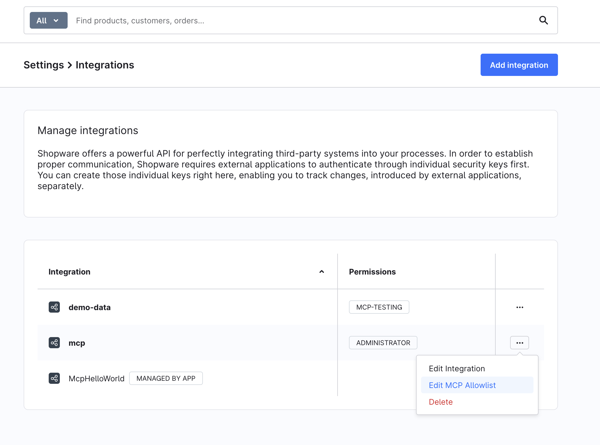
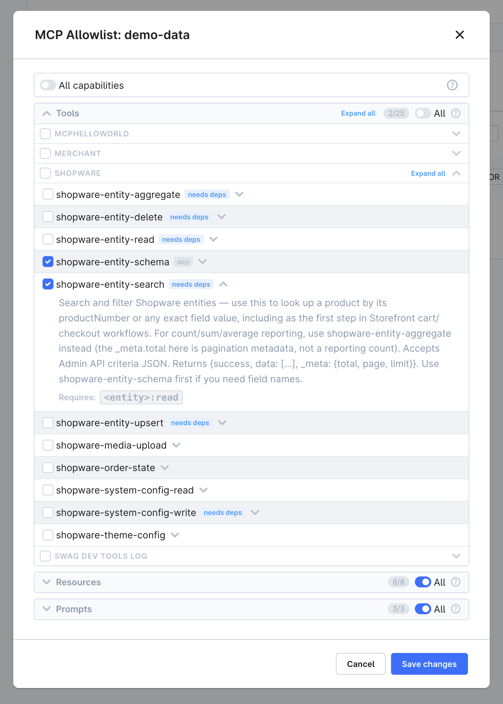

---
nav:
  title: Getting Started
  position: 20

---

# Getting Started

This guide walks you through connecting an AI client to a Shopware shop using the built-in MCP server.

## Prerequisites

- Shopware 6.7.14.0 or later. On 6.7.11.0 to 6.7.13.x, set `MCP_SERVER=1` in your `.env` file first and skip the discovery section below — see [Configuration](./configuration.md). Selecting toolsets in the connection URL requires 6.7.15.0 or later.
- `symfony/mcp-bundle` installed — verify with `composer show symfony/mcp-bundle`. If it is missing, ensure it is listed as a dependency in `composer.json` and run `composer install`.

## Step 1: Create an integration

Create a Shopware integration for the MCP client. The integration provides the credentials the client will use to authenticate.

```bash
bin/console integration:create "My MCP Client" --admin
```

This outputs an access key and secret:

```bash
SHOPWARE_ACCESS_KEY_ID=SWIA...
SHOPWARE_SECRET_ACCESS_KEY=...
```

:::info Restrict access
The `--admin` flag grants full Admin API access. For production use, omit `--admin`, create a dedicated ACL role with only the required permissions, and assign it to the integration. See [Configuration](./configuration.md#acl-and-permissions) for details.

The `--admin` flag does not bypass the MCP allowlist. Starting with Shopware 6.7.16.0, select the integration's capabilities before the client can use any tool, see [Controlling which capabilities are available](#controlling-which-capabilities-are-available).
:::

## Step 2: Configure your AI client

### Claude Desktop and Cursor

Both clients use `"type": "streamable-http"`. Add the following config to the appropriate file:

| Client                   | Config file                                                       |
| ------------------------ | ----------------------------------------------------------------- |
| Claude Desktop (macOS)   | `~/Library/Application Support/Claude/claude_desktop_config.json` |
| Claude Desktop (Windows) | `%APPDATA%\Claude\claude_desktop_config.json`                     |
| Cursor (project)         | `.cursor/mcp.json` in your project root                           |
| Cursor (user)            | `~/.cursor/mcp.json`                                              |

```json
{
    "mcpServers": {
        "shopware": {
            "type": "streamable-http",
            "url": "https://your-shop.example.com/api/_mcp",
            "headers": {
                "sw-access-key": "SWIA...",
                "sw-secret-access-key": "..."
 }
 }
 }
}
```

### Claude Code

Claude Code uses `"type": "http"` — the MCP spec calls the transport `"streamable-http"`, but Claude Code only accepts the shorter form. Create `.mcp.json` in your project root:

```json
{
    "mcpServers": {
        "shopware": {
            "type": "http",
            "url": "http://localhost:8000/api/_mcp",
            "headers": {
                "sw-access-key": "SWIA...",
                "sw-secret-access-key": "..."
 }
 }
 }
}
```

Or register via CLI:

```bash
claude mcp add --transport http shopware http://localhost:8000/api/_mcp \
 --header "sw-access-key: SWIA..." \
  --header "sw-secret-access-key: ..."
```

:::warning Keep credentials out of version control
Never commit `.mcp.json`, `.cursor/mcp.json`, or other files containing integration credentials. These files are already listed in the Shopware project template's `.gitignore`.
:::

### Codex

Codex stores MCP servers in `config.toml`, not in a JSON file. Add the server to `~/.codex/config.toml` (global) or `.codex/config.toml` in a trusted project:

```toml
[mcp_servers.shopware]
url = "https://your-shop.example.com/api/_mcp"
env_http_headers = { "sw-access-key" = "SHOPWARE_MCP_ACCESS_KEY", "sw-secret-access-key" = "SHOPWARE_MCP_SECRET_KEY" }
enabled = true
```

The `url` field tells Codex this is an HTTP MCP server. No `type` field is needed. The `env_http_headers` values are environment variable names, not the credentials themselves. Export the actual values in your shell:

```bash
export SHOPWARE_MCP_ACCESS_KEY='SWIA...'
export SHOPWARE_MCP_SECRET_KEY='...'
```

:::info Why not `codex mcp add --url`?
The CLI shortcut supports bearer-token auth but not custom HTTP headers. For Shopware's `sw-access-key` / `sw-secret-access-key` auth, editing `config.toml` directly is required.
:::

## Step 3: First connection

After adding the configuration, open or restart your AI client and look for the Shopware MCP server in the tools panel. The first connection may take a few seconds while Shopware boots its kernel and warms up caches. If the client shows "No tools" briefly, wait a moment and refresh.

Verify the server is working with the CLI:

```bash
bin/console debug:mcp
```

This lists every registered tool of both MCP servers. Use `bin/console debug:mcp --native` to list prompts and resources. A fresh AI client session initially receives only the discovery tools described in the following section.

## Discover tools on demand

Shopware keeps the initial tool surface small, regardless of how many tools an integration is allowed to call. A fresh session advertises these discovery tools:

- `shopware-tool-search`: Find relevant allowed tools from a free-text query.
- `shopware-toolsets-list`: List the toolsets of allowed tools that can be enabled.
- `shopware-toolset-enable`: Enable one toolset for the current MCP session.

When no advertised tool matches the task:

1. Call `shopware-tool-search` with a description of the required capability.
2. If the client cannot call a returned tool definition directly, call `shopware-toolsets-list` to find its toolset.
3. Enable the toolset with `shopware-toolset-enable`.
4. Refresh `tools/list`. Clients that support `notifications/tools/list_changed` do this automatically; other clients must refresh manually.

Shopware never pushes notifications on its own. A queued `notifications/tools/list_changed` reaches the client with the response to its next request, or over an open streaming connection.

Enabled toolsets remain active only for the current MCP session and are tracked by the `Mcp-Session-Id` header. The same discovery flow applies to the Admin API endpoint (`/api/_mcp`) and the [Store API endpoint](./store-api.md) (`/store-api/_mcp`).

The toolset names shipped by core are listed in the [Tools Reference](./tools-reference.md#toolsets).

### Select toolsets when connecting

Some clients read `tools/list` only once per connection and ignore `notifications/tools/list_changed`. claude.ai is one of them. In these clients, a toolset enabled during the conversation never becomes visible.

Since Shopware 6.7.15.0, you can name toolsets in the URL the client connects to. Their tools are then part of the first `tools/list`:

```text
https://your-shop.example.com/api/_mcp?toolsets=order,media
https://your-shop.example.com/api/_mcp?toolsets=all
```

- Separate toolset names with commas. `all` selects every toolset the principal may see.
- Unknown names are ignored. A malformed parameter never makes `tools/list` fail.
- The selection is read from every request and is not stored. No session is required, and nothing expires.
- The parameter only changes which tools are advertised. The MCP allowlist and the ACL role still decide what may be called, so a toolset outside the allowlist stays hidden.
- Without the parameter, the endpoint behaves as before.

The Store API endpoint accepts the same parameter, for example `/store-api/_mcp?toolsets=store-api`.

Prefer a short list of focused toolsets over `all`. Every advertised tool uses space in the agent's context window, and `tools/list` is paginated with 50 entries per page. A client that ignores `nextCursor` sees only the first page.

## Authentication methods

### Integration credentials (recommended)

Pass `sw-access-key` and `sw-secret-access-key` as HTTP headers. Credentials are valid as long as the integration exists, with no token expiration or manual refresh required.

### Bearer token

Standard Admin API OAuth bearer tokens also work. Obtain one via the `/api/oauth/token` endpoint. Tokens expire (default: 10 minutes), so integration credentials are preferred for persistent MCP clients. When authenticated via bearer token, the user's per-user allowlist applies (configured under **Settings → Users & Permissions → [user] → MCP tool allowlist**).

A missing, invalid, or expired token is answered with HTTP 401 and the JSON-RPC error code `-32001`. The message includes the reason, such as `Access token is expired`, so the client can refresh the token. Before Shopware 6.7.15.0, `/api/_mcp` answered these cases with HTTP 500 and `-32000`.

## Controlling which capabilities are available

Which capabilities an integration may call depends on its allowlist and on the Shopware version:

- **6.7.16.0 and later:** An integration without an allowlist may call nothing. Only the three discovery tools are available, and they return nothing until you select capabilities. The same applies to non-admin users. Admin users bypass the allowlist.
- **Before 6.7.16.0:** An integration without an allowlist may call all registered tools, resources, and prompts.

In both cases, only the discovery tools are advertised at the start of a session. To select which capabilities can be discovered and called:

**Per integration** — Go to **Settings → Integrations**, open the context menu for your integration, and select **Edit MCP Allowlist**:

   

Select the tools, resources, and prompts this integration should use. On versions before 6.7.16.0, disable the **All** toggle of a capability type first:

   

**Per user** — Go to **Settings → Users & Permissions**, open the user detail page, and manage the **MCP tool allowlist** card at the bottom of the page. This allowlist applies when the user authenticates via a user access key or bearer token. Admin users bypass the allowlist entirely.

When a tool is enabled, its declared dependencies are automatically included. For example, enabling `shopware-entity-delete` also enables `shopware-entity-search` and `shopware-entity-schema` because they are required for it to work.

See [Configuration](./configuration.md) for the global `allowed_tools` safety switch, the full per-principal allowlist reference, and session store options.

## Try your first prompts

Your AI client is now connected to Shopware. Try a few prompts to verify that the MCP server is working correctly.

For example:

- Show all products in my store.
- Find products with stock below five units.
- Find all active products without descriptions.
- Generate SEO-friendly meta titles for your products (eg, guitars)
- Increase prices of products in a specific category by 5%. Show a preview before applying the changes.

If the AI can retrieve data and respond to these requests, your integration is ready to use.

## Next steps

- [Tools Reference](./tools-reference.md): explore all built-in tools and resources
- [Examples](./examples.md): try common workflows end-to-end
- [Troubleshooting](./troubleshooting.md): fix connection and permission issues
