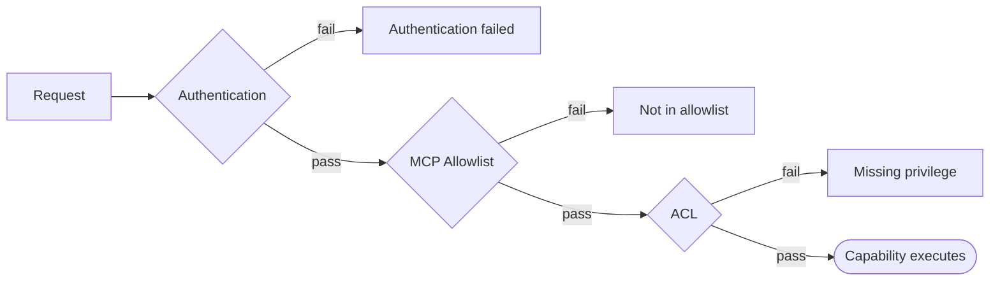

---
nav:
  title: Troubleshooting
  position: 60

---

# Troubleshooting

## Quick reference

| Symptom                                                  | Likely cause                                              | Fix                                                                                                                               |
|----------------------------------------------------------|-----------------------------------------------------------|-----------------------------------------------------------------------------------------------------------------------------------|
| `Authentication failed. Configure your MCP client...`    | Wrong or missing credentials                              | Check `sw-access-key` / `sw-secret-access-key` in your client config                                                               |
| `Tool "X" is not in the allowlist...`                    | Tool not enabled for this integration                     | Settings → Integrations → Edit MCP Allowlist → enable the tool                                                                     |
| `Resource "X" is not in the allowlist...`                | Resource not enabled for this integration                 | Settings → Integrations → Edit MCP Allowlist → enable the resource                                                                 |
| `Prompt "X" is not in the allowlist...`                  | Prompt not enabled for this integration                   | Settings → Integrations → Edit MCP Allowlist → enable the prompt                                                                   |
| `Missing privilege: {entity}:read`                       | Integration role lacks the permission                     | Assign an ACL role with the required privilege, or use `--admin`                                                                   |
| Only three tools appear in a fresh session               | Expected progressive discovery behavior                   | Use `shopware-tool-search` or enable a group with `shopware-toolset-enable`                                                        |
| Allowed tool missing from `tools/list`                   | Its toolset is not enabled                                | Search for the tool, enable its toolset, then refresh `tools/list`                                                                 |
| Enabled toolset does not appear                          | Client ignored `notifications/tools/list_changed`         | Refresh `tools/list` manually                                                                                                      |
| No tools appear in `tools/list`                          | Discovery tools were removed by global `allowed_tools`    | Add all three discovery tools to `shopware.mcp.allowed_tools`                                                                      |
| Admin integration but tool still blocked                | Per-integration allowlist is set                          | Admin bypasses ACL only; the integration allowlist still applies                                                                  |
| Tool search returns every tool for an admin user         | Admin user login bypasses the per-user allowlist          | Use a non-admin user when the per-user allowlist must apply                                                                         |
| Tool missing entirely                                   | Extension inactive or capability registration missing     | Check `bin/console debug:mcp`                                                                                                      |
| `ECONNREFUSED` or "fetch failed"                        | Server not running or wrong URL                           | Start Shopware and verify the URL in your client config                                                                            |
| Client shows "Needs authentication" after failed connect | Client fell back to `/register` OAuth endpoint            | Verify the credentials and ensure the URL ends with `/api/_mcp`                                                                    |

## Connection issues

### ECONNREFUSED or "fetch failed"

Your MCP client cannot reach the Shopware server.

1. Start the Shopware server (Docker, ddev, or your usual local setup).
2. Verify the URL in your MCP client config matches how you access the shop (host and port).
3. For local development, confirm the shop is reachable at the same URL in a browser before retrying the MCP client.

### Client shows "Needs authentication" or falls back to `/register`

Some MCP clients (e.g., Cursor) follow the OAuth 2.0 dynamic client registration flow when the primary connection fails. They automatically POST to `{server-origin}/register`, expecting a JSON error response. Shopware handles this and returns a structured error so the client can display a "Needs authentication" state instead of an opaque connection failure.

If you see this state, the root cause is in your credentials or URL, not the fallback itself:

1. Confirm your `sw-access-key` starts with `SWIA` (integration access key, not a user or sales channel key).
2. Confirm your `sw-secret-access-key` matches the secret shown when the integration was created.
3. Confirm the URL in your client config ends with `/api/_mcp` (not `/api/_action/mcp/tools` or the shop root).

## Client-specific issues

### Claude Code: "Does not adhere to MCP server configuration schema"

Claude Code requires `"type": "http"` in `.mcp.json`. The MCP spec transport name is `"streamable-http"`, which other clients accept, but Claude Code only accepts the shorter `"http"` form. Change your config:

```json
{
    "mcpServers": {
        "shopware": {
            "type": "http",
            "url": "http://localhost:8000/api/_mcp",
            "headers": {
                "sw-access-key": "SWIA...",
                "sw-secret-access-key": "..."
 }
 }
 }
}
```

## Tool registration issues

### Tool missing from `bin/console debug:mcp`

If a tool does not appear in the `debug:mcp` output, it will also be missing from the live endpoint.

**For plugin tools:**

- Confirm the plugin is installed and activated: `bin/console plugin:list`
- Confirm the service has `<tag name="shopware.mcp.tool"/>` in `services.xml`
- Confirm `#[McpTool]` is on the **class**, not on `__invoke()`
- Run `bin/console cache:clear` after changes

**For core/bundle tools:**

- Confirm the directory is listed in `config/packages/mcp.php` `scan_dirs`
- Confirm the service has the correct DI tag (`mcp.tool` for in-tree bundles)

## Security layers

The MCP endpoint passes every request through three independent security layers. A request must clear all three before a capability executes:



**Authentication (Layer 1):** Pass `sw-access-key` and `sw-secret-access-key` headers. Obtain credentials from Settings → Integrations.

**MCP Allowlist (Layer 2):** Allowlists are scoped per principal: each integration has its own allowlist under Settings → Integrations → Edit MCP Allowlist, and each user has their own under Settings → Users & Permissions → [user] → MCP Tool Allowlist. `null` per type means all capabilities of that type are accessible; an empty array `[]` means none are accessible. The three server-owned discovery tools remain available, but cannot expose or enable tools denied by the effective allowlist. The `admin` flag on an integration does **not** bypass the allowlist; it only bypasses layer 3 (ACL).

Which allowlist applies depends on the auth method: integration credentials use the integration allowlist; user access keys and user bearer tokens use the per-user allowlist; admin user accounts (`admin = true`) bypass the allowlist entirely. When an app forwards `sw-app-user-id` alongside integration credentials (e.g., Copilot), Shopware applies the **intersection** of the integration and user allowlists.

**ACL (Layer 3):** Even if a capability is in the allowlist, the integration's ACL role must have the required entity-level permissions.
