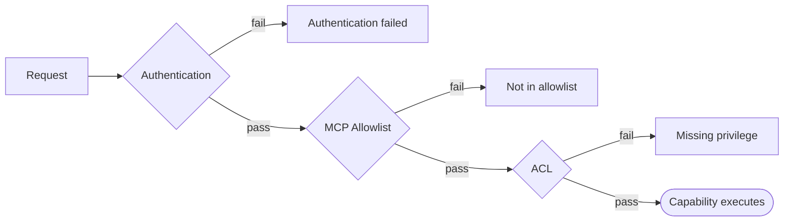

---
nav:
  title: Troubleshooting
  position: 60

---

# Troubleshooting

## Quick reference

| Symptom                                                       | Likely cause                                           | Fix                                                                                            |
| ------------------------------------------------------------- | ------------------------------------------------------ | ---------------------------------------------------------------------------------------------- |
| `Authentication failed. Configure your MCP client...`         | Wrong or missing credentials                           | Check `sw-access-key` / `sw-secret-access-key` in your client config                           |
| HTTP 401 with JSON-RPC code `-32001`                          | Bearer token missing, invalid, or expired              | Refresh the token; the error message names the reason                                          |
| `Tool "X" is not enabled in your MCP allowlist.`              | Tool not enabled for this integration                  | Settings → Integrations → Edit MCP Allowlist → enable the tool                                 |
| `Resource "X" is not enabled in your MCP allowlist.`          | Resource not enabled for this integration              | Settings → Integrations → Edit MCP Allowlist → enable the resource                             |
| `Prompt "X" is not enabled in your MCP allowlist.`            | Prompt not enabled for this integration                | Settings → Integrations → Edit MCP Allowlist → enable the prompt                               |
| All tool calls rejected after updating to 6.7.16.0            | Integration or non-admin user has no allowlist         | Select capabilities, see [Per-principal allowlist](./configuration.md#per-principal-allowlist) |
| Resources or prompts gone after updating to 6.7.16.0          | Allowlist stores `null` for that type                  | Save the allowlist again with the capabilities selected                                        |
| `Missing privilege: {entity}:read`                            | Integration role lacks the permission                  | Assign an ACL role with the required privilege, or use `--admin`                               |
| Only three tools appear in a fresh session                    | Expected progressive discovery behavior                | Use `shopware-tool-search` or enable a toolset with `shopware-toolset-enable`                  |
| Allowed tool missing from `tools/list`                        | Its toolset is not enabled                             | Search for the tool, enable its toolset, then refresh `tools/list`                             |
| Enabled toolset does not appear                               | Client ignored `notifications/tools/list_changed`      | Refresh `tools/list` manually, or connect with `?toolsets=<name>`                              |
| Enabled toolset never appears in claude.ai                    | Client reads `tools/list` once per connection          | Add `?toolsets=<name>` to the connection URL (6.7.15.0 and later)                              |
| `Invalid criteria: /aggregations/0/...`                       | Malformed criteria or aggregation definition           | Fix the element named by the JSON pointer and retry                                            |
| No tools appear in `tools/list`                               | Discovery tools were removed by global `allowed_tools` | Add all three discovery tools to `shopware.mcp.allowed_tools`                                  |
| Admin integration but tool still blocked                      | Per-integration allowlist is set                       | Admin bypasses ACL only; the integration allowlist still applies                               |
| Tool search returns every tool for an admin user              | Admin user login bypasses the per-user allowlist       | Use a non-admin user when the per-user allowlist must apply                                    |
| `shopware-tool-search` returns nothing                        | Query too vague; low-scoring matches are dropped       | Search with concrete domain wording, or list toolsets with `shopware-toolsets-list`            |
| `Cannot enable an MCP toolset without an active MCP session.` | Client did not send the `Mcp-Session-Id` header        | Complete the `initialize` handshake and send the returned session ID with every request        |
| `Invalid value for pagination parameter "cursor"`             | Cursor is stale, malformed, or from another principal  | Restart the list from the first page without a `cursor`                                        |
| Toolsets are forgotten between requests                       | Session store is not shared across workers             | Use a Redis session store in multi-server setups                                               |
| Store API session rejected after updating to 6.7.15.0         | Each server now has its own session store              | Send `initialize` again to get a new session                                                   |
| Tool missing entirely                                         | Extension inactive or capability registration missing  | Check `bin/console debug:mcp`                                                                  |
| Prompts and resources missing from `debug:mcp`                | Since 6.7.15.0, the command lists tools only           | Run `bin/console debug:mcp --native`                                                           |
| `ECONNREFUSED` or "fetch failed"                              | Server not running or wrong URL                        | Start Shopware and verify the URL in your client config                                        |
| Client shows "Needs authentication" after failed connect      | Client fell back to `/register` OAuth endpoint         | Verify the credentials and ensure the URL ends with `/api/_mcp`                                |
| A tool returns `shopware://tool-result/...` instead of data   | Result exceeded 100 KB and was offloaded               | Read the URI as a resource, or narrow the request with a smaller `limit` or fewer fields       |

## Connection issues

### ECONNREFUSED or "fetch failed"

Your MCP client cannot reach the Shopware server.

1. Start the Shopware server (Docker, ddev, or your usual local setup).
2. Verify the URL in your MCP client config matches how you access the shop (host and port).
3. For local development, confirm the shop is reachable at the same URL in a browser before retrying the MCP client.

### Client shows "Needs authentication" or falls back to `/register`

Some MCP clients (e.g., Cursor) follow the OAuth 2.0 dynamic client registration flow when the primary connection fails. They automatically POST to `{server-origin}/register`, expecting a JSON error response. Shopware handles this and returns a structured error so the client can display a "Needs authentication" state instead of an opaque connection failure.

If you see this state, the root cause is in your credentials or URL, not the fallback itself:

1. Confirm your `sw-access-key` starts with `SWIA` (integration access key, not a user or sales channel key).
2. Confirm your `sw-secret-access-key` matches the secret shown when the integration was created.
3. Confirm the URL in your client config ends with `/api/_mcp` (not `/api/_action/mcp/tools` or the shop root).

## Client-specific issues

### Claude Code: "Does not adhere to MCP server configuration schema"

Claude Code requires `"type": "http"` in `.mcp.json`. The MCP spec transport name is `"streamable-http"`, which other clients accept, but Claude Code only accepts the shorter `"http"` form. Change your config:

```json
{
    "mcpServers": {
        "shopware": {
            "type": "http",
            "url": "http://localhost:8000/api/_mcp",
            "headers": {
                "sw-access-key": "SWIA...",
                "sw-secret-access-key": "..."
 }
 }
 }
}
```

## Tool registration issues

### Tool missing from `bin/console debug:mcp`

If a tool does not appear in the `debug:mcp` output, it will also be missing from the live endpoint.

**For plugin tools:**

- Confirm the plugin is installed and activated: `bin/console plugin:list`
- Confirm the service is tagged with `shopware.mcp.tool` in `services.php`
- Confirm `#[McpTool]` is on the **class**, not on `__invoke()`
- Run `bin/console cache:clear` after changes

**For core/bundle tools:**

- Confirm the service has the correct DI tag (`shopware.mcp.tool`, or `shopware.store_api_mcp.tool` for the Store API)
- Check the warning below the `debug:mcp` tool list. It names capabilities that carry an MCP attribute but that no server exposes. `bin/console debug:mcp --native` shows the same for prompts and resources.
- On 6.7.14.x and earlier, confirm the directory is listed in `scan_dirs` in `config/packages/mcp.php`. Since 6.7.15.0, capabilities are registered from their tag and `scan_dirs` no longer exists.

## Authentication issues

### HTTP 401 with JSON-RPC code `-32001`

Since Shopware 6.7.15.0, `/api/_mcp` answers a missing, invalid, or expired bearer token with HTTP 401 and the JSON-RPC error code `-32001`. The message contains the OAuth reason, for example `Missing "Authorization" header` or `Access token is expired`. Clients that support token refresh use this status to request a new token.

Before 6.7.15.0, the same cases returned HTTP 500 with the code `-32000`, which clients treated as a server outage. `/store-api/_mcp` already answered with 401.

## Security layers

The MCP endpoint passes every request through three independent security layers. A request must clear all three before a capability executes:


```mermaid
flowchart LR
 A[Request] --> B{Authentication}
 B -- fail --> E1["Authentication failed"]
 B -- pass --> C{MCP Allowlist}
 C -- fail --> E2["Not in allowlist"]
 C -- pass --> D{ACL}
 D -- fail --> E3["Missing privilege"]
 D -- pass --> F([Capability executes])
```

**Authentication (Layer 1):** Pass `sw-access-key` and `sw-secret-access-key` headers. Obtain credentials from Settings → Integrations.

**MCP Allowlist (Layer 2):** Allowlists are scoped per principal: each integration has its own allowlist under **Settings → Integrations → Edit MCP Allowlist**, and each user has their own under **Settings → Users & Permissions → [user] → MCP tool allowlist**. An array lists the accessible capabilities of a type, and an empty array `[]` means none are accessible. Since Shopware 6.7.16.0, an unset allowlist or a `null` type also means none are accessible. Before 6.7.16.0, it meant all of them. The three server-owned discovery tools remain available, but cannot expose or enable tools denied by the effective allowlist. The `admin` flag on an integration does **not** bypass the allowlist; it only bypasses layer 3 (ACL).

Which allowlist applies depends on the auth method: integration credentials use the integration allowlist; user access keys and user bearer tokens use the per-user allowlist; admin user accounts (`admin = true`) bypass the allowlist entirely. When an app forwards `sw-app-user-id` alongside integration credentials (e.g., Copilot), Shopware applies the **intersection** of the integration and user allowlists.

Bearer tokens obtained through the Administration login (`client_id = administration`) resolve to the logged-in user. They use that user's allowlist, and an admin user bypasses it. Test allowlist behavior with integration credentials or with a non-admin user, never with a token copied out of the Administration session of an admin user.

The Store API endpoint has no allowlist layer at all — see [Store API MCP](./store-api.md).

**ACL (Layer 3):** Even if a capability is in the allowlist, the integration's ACL role must have the required entity-level permissions.
