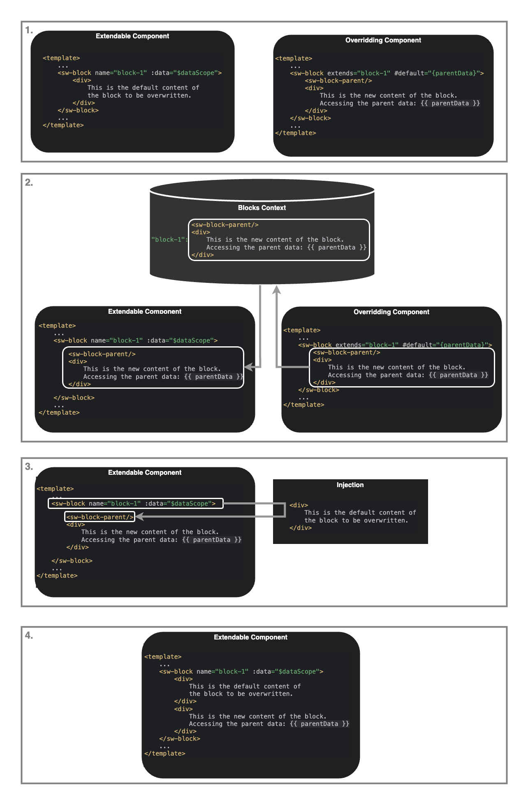

# Native Block System in Shopware

::: info
This document represents an architecture decision record (ADR) and has been mirrored from the ADR section in our Shopware 6 repository.
You can find the original version [here](https://github.com/shopware/shopware/blob/trunk/adr/2024-09-26-native-block-system.md)
:::

## Context
The current block system relies on TwigJs for creating reusable and extendable component template.
This system allows plugin developers to override or extend content in predefined blocks using TwigJs’s inheritance mechanisms. Vue.js offers a more dynamic and reactive component-based architecture which is better suited for modern frontend development.

To replace TwigJs with a native Vue.js approach we need to introduce two new component `sw-block` and `sw-block-parent`.

The new `sw-block` and `sw-block-parent` components in Vue.js aim to replicate and improve on the TwigJs block system by providing a component-based approach. These components offer enhanced flexibility by allowing dynamic content overriding and extension directly in Vue’s templating and reactivity model.

## Decision
We have decided to migrate from the TwigJs-based block system to the Vue.js-based `sw-block` system. This decision aligns with the following goals:

1. **Uniform Frontend Stack**: Vue.js is already used for the frontend in Shopware Administration. Moving blocks from TwigJs to Vue.js creates consistency in the technology stack, simplifying development and reducing the cognitive load on developers who previously had to switch between TwigJs and Vue.js.

2. **Improved Flexibility**: With Vue.js blocks we have control over the provided access to the component’s internals, allowing for more granular control over block behavior and content. This allows us to create a public API for any component, making it easier to extend and modify internal behavior, without breaking the public API.

### Architecture Description of the Vue.js Block System

This Vue.js block system uses two main components: `sw-block` and `sw-block-parent`, to enable dynamic content overriding and extension, replacing the traditional TwigJs blocks.

1. The `sw-block` defines a block with default content. An overriding component extends this block using the `extends` attribute, optionally accessing the parent content with `sw-block-parent`.

2. The Block Context manages the relationship between blocks.

3. The `sw-block-parent` allows injecting the original block's content into the extended block, enabling partial content overrides.

This architecture streamlines content management, providing a flexible and reusable component system ideal for dynamic UI compositions.

## Consequences
### Positive Consequences
1. **Consistency and Maintainability**: With all frontend logic now centralized in Vue.js, developers will no longer need to manage two separate templating systems. This simplification enhances code maintainability and consistency across the application.

2. **Enhanced Extensibility**: The new `sw-block` system allows blocks to be overridden and extended using native Vue.js slots, making it easier for developers to introduce custom behaviors and content into existing components.

3. **Improved Performance**: Vue.js components are more performant when handling dynamic content updates, reducing the rendering overhead associated with rendering in TwigJs. This will lead to smoother UI updates and potentially lower client load.

4. **Component Reusability**: Since `sw-block` is a Vue.js component, it can be composed with other Vue.js components, enhancing the reusability of UI blocks across different parts of the application.

### Negative Consequences
1. **Migration Complexity**: Migrating from TwigJs to Vue.js will require refactoring existing blocks and adjusting the development workflow. This may introduce temporary disruptions as developers need to learn and apply the new system.

2. **Component Structure Breakage**: The insertion of blocks may interfere with existing v-if, v-else, and v-else-if conditions, as blocks can disrupt the flow and logic of these conditionals by placing content between them.

3. **Slot Usage Breakage**: Blocks can disrupt the parent-child slot relationship, leading to issues where a block is inserted between a child slot and its parent, breaking the intended slot composition.
