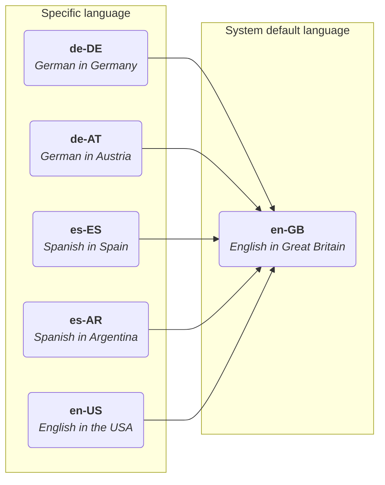
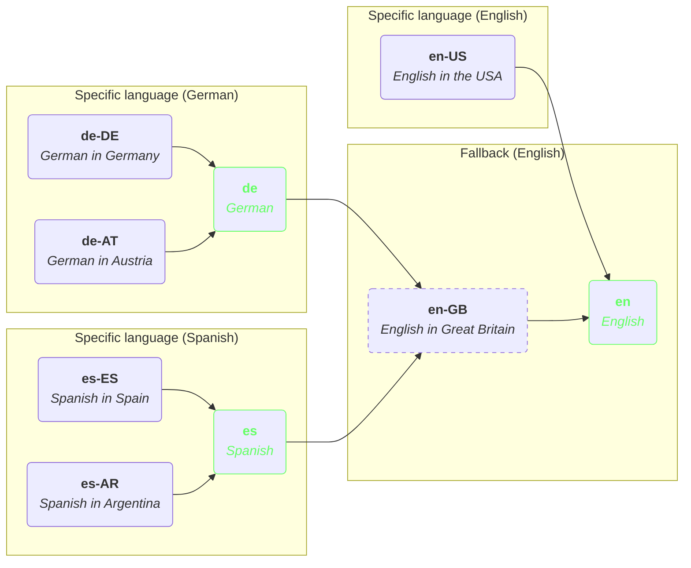

## Context
Currently, Shopware’s language system uses a specific language locale (e.g. `de-DE` for German in Germany) for its translation, while falling back to another specific locale (e.g. `en-GB` for English in Great Britain).

This works well, but it is quite maintenance-heavy. If you use multiple versions or dialects of a language, such as British and American English, it will result in a lot of duplicated snippets.

### Some facts and figures
- Shopware has approximately 12,000 snippets.
- By default, the US translation is an automated copy of the GB translation, which is later adjusted by our community via Crowdin.
- When running them through a comparison tool, we find about 70 differences. This means that roughly 99.5% of our American snippets are identical to the British ones.

### Current structure

## Decision
Another layer containing a country-agnostic language (e.g., `en` for both `en-GB` and `en-US`) will provide an additional fallback layer. This means dialects are now treated as patch files. In Shopware, `en-GB` will be renamed to `en`, as you have to select a base dialect, retaining its 12,000 snippets, while `en-US` will shrink to around 70 snippets. This also eliminates the need for tools to initially copy-paste or pre-translate from "English to English," which, of course, incurs costs.

## Consequences
- Every additional dialect’s snippet file (e.g., `en-US` for `en`) will shrink from around 12,000 entries to likely fewer than 100.
- We will also provide an additional layer to maximize compatibility with existing installations. This means that `en-GB` will still be available as a fallback for other languages like `de-DE`, but `en` will be the primary fallback for everything.
- We will also provide an additional layer to ensure maximum compatibility with existing translations (e.g. via extensions). This means `en-GB` will remain available as a fallback for other languages such as `de-DE` and `de`, while `en` will serve as the final fallback.
- Translations provided via the community (Crowdin) will show a lower coverage percentage, but will more accurately reflect the actual differences between `en-US` and `en`.
- In Crowdin and in our product, the base language is set declaratively, so we will inform the community that British English is our base language, and we simply refer to it as `en`.
- All snippet files in Shopware’s core will be renamed to the country-agnostic language
    - `en-GB.json` -> `en.json`, `messages.en-GB.base.json` -> `messages.en.base.json` and so on.
    - Similarly: `de-DE` -> `de`
- The community translations / language pack will update their locales to their country-agnostic versions as well (e.g., `es-ES` -> `es`).
- The system’s default language or active language handling will remain unchanged.
- Plugins and apps do not require immediate adjustments, as the previous structure will continue to function as before as well.

### New structure

