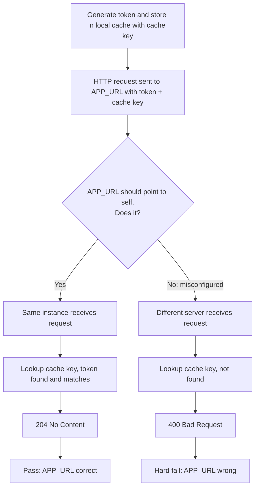

# Improved APP URL verification utils

::: info
This document represents an architecture decision record (ADR) and has been mirrored from the ADR section in our Shopware 6 repository.
You can find the original version [here](https://github.com/shopware/shopware/blob/trunk/adr/2026-03-18-app-url-verify-utils.md)
:::

## Context

Recent improvements in Shopware, including the introduction of the fingerprinting mechanism for the Shop ID (see PR https://github.com/shopware/shopware/pull/11677), have made it possible to detect changes in the Shopware environment that should trigger a Shop ID change. Examples include when the APP_URL changes or the environment otherwise looks different, such as when a production shop is copied to a staging system.

Detecting these changes allows us to cut off communication with app servers until the Shop ID has been updated. Amongst other issues, this prevents two different shops from communicating as the same shop to an app server.

However, risks remain:

* Different shops might use the same APP_URL.
* A shop might be configured with an incorrect APP_URL.
* Copying a production shop to a staging system might not be detected as a change (installation path, sales channel domains, etc. remain the same).

Some APP URL verification already exists in the Shopware Administration, but we want to improve its robustness.

## Decision

When a Shop ID changes (see scenarios below): we verify that the APP_URL points back to the same instance of Shopware (itself).

We achieve this by introducing a new public API end point `api/app-system/shop/verify`.

Verification flow:

1. Shopware calls this endpoint on the instance defined by the configured APP_URL environment variable.
2. The request includes a random token and a cache key stored in a short-lived cache.
3. The endpoint loads the cached value using the key and verifies the token matches.
4. If successful, we can assume with high probability that the APP_URL points to the correct instance.



Shop ID change scenarios:
* Migration from v1 to v2 structure (on Shop ID load).
* APP_URL changed (when no apps installed).
* The installation path of Shopware changed (when no apps installed).
* New Shop ID generated (where no ID existed before).
* After app communication was cut off due to fingerprint mismatches and the user manually resolved using one of the provided strategies.

For now, we don't act upon this result, we simply just record the result.

We also introduce two new commands:

```shell
php bin/console app:url:verify //maunally verify the APP_URL
php bin/console app:url:status //print the current stored result
```

NOTE: Integrating the check and result into live communications will be handled in a later ADR and PR. This ADR documents the problems and introduces the base infrastructure code which will be later used to at runtime.

### Verification states:
1. Pass - The APP URL was successfully verified. APP URL points to the same instance as the running shop.
2. Soft fail - The APP URL was not verified, due to connectivity issues, server errors, etc. Verification is retried with exponential backoff up to once per hour, while app communication continues.
3. Hard fail - The APP URL does not point to the same instance as running shop. This should be resolved by the shop owner.

### Handled scenarios:

#### Copying a production environment to staging with a fingerprint **mismatch**:

When an environment is copied from production to staging and the fingerprints do not match. For example, the installation path was changed, or the APP_URL was changed.

1. Shop ID is fetched for some action
2. Fingerprint mismatch detected
3. App communication is cut off (if apps with backends are installed)
    4. Shop owner must resolve the issues
    5. New shop ID is generated (ShopIdChangedEvent dispatched)
    6. APP_URL is verified right away
    7. If fails, app communication is cut off again
4. Shop ID is regenerated (if no apps with backends are installed)
    5. APP_URL is verified right away
    6. If fails, app communication is cut off again

#### Copying a production environment to staging when the fingerprints **match**:

When an environment is copied from production to staging and the fingerprints match. For example, the installation path was not changed, and the APP_URL was not changed.

1. Shop ID is fetched for some action
2. URL verifier checks cache for a verification result
3. If none is found, APP_URL is verified right away
4. If found, the result is interrogated:
    5. Pass - continue with action
    6. Soft fail - increment fail counter, but continue with action. Retries are performed with exponential backoff up to once per hour.
    7. Hard fail - Throw exception and interrupt flow

#### APP URL change:

1. Remove cached verification result
2. APP_URL is verified right away

## Consequences
* APP_URL is verified when the Shop ID changes.
* APP_URL is verified every 24 hours.
* App communication is cut off if the URL validation fails.
* The user is prompted to resolve the issue in the admin (this feature already exists)
