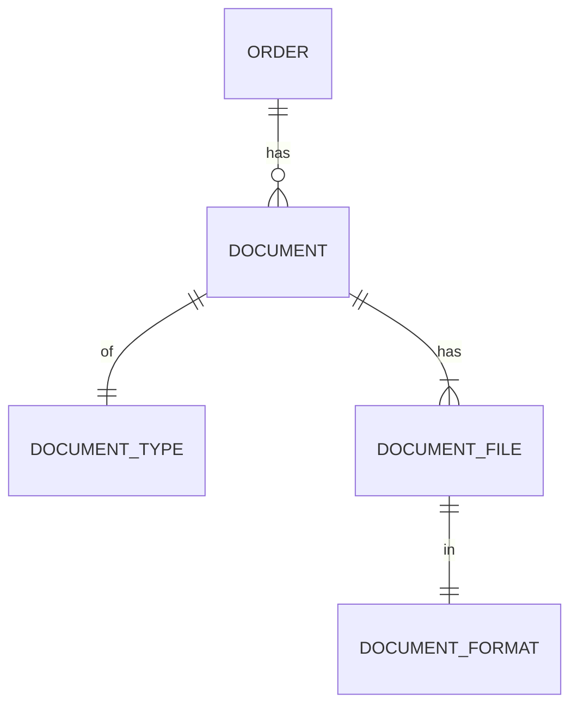
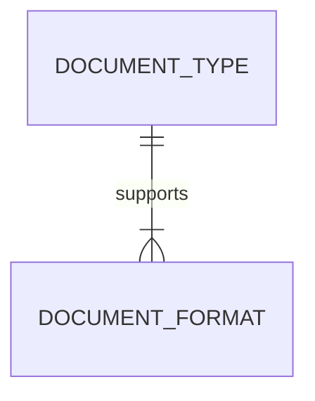
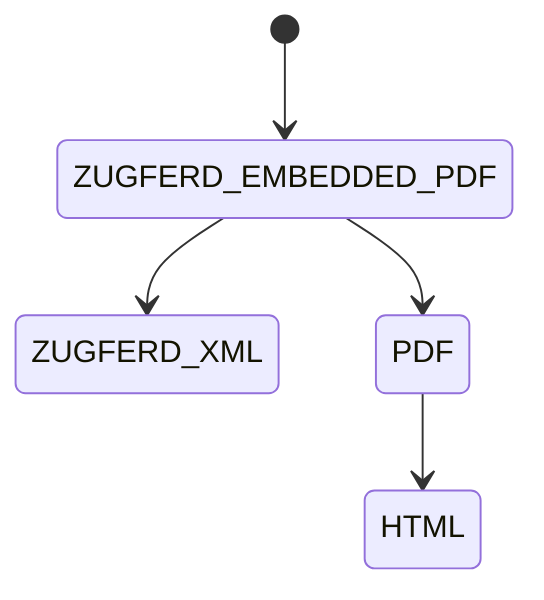

# New document generation architecture

::: info
This document represents an architecture decision record (ADR) and has been mirrored from the ADR section in our Shopware 6 repository.
You can find the original version [here](https://github.com/shopware/shopware/blob/trunk/adr/2026-03-18-new-document-generation-architecture.md)
:::

## Disclaimer

This document focuses on the high-level architecture and design decisions
of the new (refactored) document generation.
It does not cover every little detail of the implementation, which
will be figured out during the implementation phase.
Instead, it tries to reduce uncertainty and set a clear direction that everyone agrees on,
so that the implementation doesn't end up being done twice.

If you have not already, you should read
[2026-03-17-refactor-of-document-generation.md](https://github.com/shopware/shopware/blob/trunk/adr/2026-03-17-refactor-of-document-generation.md)
first, to understand the reasoning behind and goals of the new document generation.

## Glossary

Document format:
A specific representation of a document, e.g. PDF, HTML, Zugferd-XML, Zugferd-Embedded-PDF.

Document type:
A certain type of document, e.g. invoice, delivery note, credit note, cancellation invoice.

Document file:
A document file of a certain document type represented in a certain format (e.g. invoice in PDF).

Document:
A document with a single document number is represented by one or more files in specific formats
(e.g. invoice number 1001, available in PDF and HTML).
All associated document files are based on the same order (version) data and document number.

## Concepts

### Entity relations



- An order has zero or more `document`s.
- Each `document` is of a single `document_type`.
- Each `document` has one or more `document_file`s.
- Each `document_file` is in a single `document_format`.



- Each `document_type` supports one or more `document_format`s.
- This information can later be used in the admin UI or for the API user to determine which
  generation options are available.

#### Disclaimer

Neither `document_type` nor `document_format` are entities in the database.
They will only be stored as simple string values in the `document` and `document_file` entities.

To find all available document types and formats, we will provide an API endpoint that iterates over all
document providers and document renderers and returns the supported document types and their formats.

It will also consider any additional document types and formats that are registered in an App manifest.

The reasoning behind this is that storing them in the DB could lead to issues. For example, when an extension
gets uninstalled, it would have to clean up properly; otherwise, these types and formats might remain broken in the system.

### Generation dependencies

We learned from the current implementation that there are often dependencies between document formats.
This diagram shows the dependencies between document formats when generating an invoice in Zugferd-Embedded-PDF format:



Where the generation process could look like this:

1. Generate HTML from a Twig template and order data.
2. Generate PDF from the HTML using DomPDF.
3. Generate Zugferd XML from a different Twig template and order data.
4. Generate Zugferd Embedded PDF by combining the Zugferd XML and the PDF into a single file.
5. Only step 4 is persisted as an artifact (`document_file`) of the document generation, as requested by the user.

But potentially multiple formats can be artifacts of the same generation process.
For example, if the user wants to generate an invoice in PDF, HTML, and Zugferd XML format,
all of them would be persisted as artifacts (`document_file`).

## High-level architecture

- The `DocumentGenerator` owns the orchestration of the generation process.
- The `DocumentDataProvider` layer owns data collection and enrichment.
- The `DocumentRenderer` layer owns the transformation into specific formatted artifacts.

Next, each level is described in more detail.

### Caller API (DocumentGenerator)

Documents can be generated by using the `Shopware\Core\Checkout\DocumentV2\DocumentGenerator` service.

It has one public method with a signature that could look like this:

```php
/**
 * @param list<string> $formats
 */
public function generate(
    string $orderId,
    string $orderVersionId,
    string $docType,
    array $formats,
    Context $context,
    ?string $docNumber = null,
): DocumentEntity
```

The caller is responsible for:
- Creating an order version to persist the order data in its current state.
  - Then passing in an existing order version for which documents should be generated.
  - Passing in `LIVE_VERSION` is not allowed and will throw an exception.
- Passing in a single document type.
  - It is passed as a string by design for extensibility, but you can use the `DocumentType` enum values.
  - The actual implementation will probably use a union type of `DocumentType|string` in all relevant places.
- Passing in a list of formats for which the document should be generated.
  - Again, this is a string by design, but you can use the `DocumentFormat` enum values.
  - The actual implementation will probably use a union type of `DocumentFormat|string` in all relevant places.
- Passing in a Shopware context with the necessary permissions to generate the document.
- Optionally passing in a document number to use for the document; otherwise, a new one will be generated.

On success, it returns the document entity, which was already persisted with all its document files in the DB.
You can use it to access the media URL of the generated document files as well as other metadata.

Disclaimer: The actual method signature might change during implementation and likely will use
a DTO class instead of passing in so many scalar parameters.

There will also be a Symfony controller and admin API HTTP endpoint calling this method, to make
it possible to generate documents from the admin frontend as well.

### Provider design

Every document data provider is:

- A Symfony service.
- Tagged with `shopware.documentV2.provider`.
- Responsible for one or more document types.
  - By providing data that is later used by the renderers.
- Extending the abstract `AbstractDocumentDataProvider` class to follow a certain interface.
- Automatically called by the `DocumentGenerator` service at the right time and at most once per generation call.

This is based on Symfony tagged services, which makes it easy for us and for third-party plugins
to add new document data providers.

A rough draft of the `AbstractDocumentDataProvider` interface looks like this
(note this might change slightly during implementation)

```php
abstract class AbstractDocumentDataProvider
{
    /**
     * All document types this provider supports.
     *
     * @see DocumentType
     *
     * @return list<string> document types passed as strings
     */
    abstract public function getDocumentTypes(): array;

    /**
     * Unique key for this provider, used to retrieve its data from the @see RenderInput.
     */
    abstract public function getKey(): string;

    /**
     * Enrich order criteria with additional associations
     */
    public function enrichOrderCriteria(Criteria $criteria): void
    {
        // nothing by default
    }

    abstract public function provideRenderingData(OrderEntity $order): RenderData;
}
```

Some further remarks on the data providers:
- They can enrich the order criteria with additional associations via `enrichOrderCriteria`.
- They provide render data and get access to the order entity.
  - `RenderData` is an almost empty abstract class, and each provider should create its own DTO class extending it.
  - They should return their concrete DTO class in their implementation of `provideRenderingData`.
  - It will be stored in the `RenderInput` (used and explained later) under the key returned by `getKey`.

### Renderer design

Every renderer is:

- A Symfony service.
- Tagged with `shopware.documentV2.renderer`.
- Responsible for rendering a single format.
  - Of one or more document types.
  - But only one document type at a time, per generation call.
- Extending the abstract `AbstractDocumentRenderer` class to follow a certain interface.
- Automatically called by the `DocumentGenerator` service at the right time and at most once per generation call.

A rough draft of the `AbstractDocumentRenderer` interface looks like this
(note this might change slightly during implementation)

```php
abstract class AbstractDocumentRenderer
{
    /**
     * If the renderer supports a specific document type.
     *
     * @see DocumentType
     */
    abstract public function supports(string $docType): bool;

    /**
     * The format this renderer produces.
     *
     * @see DocumentFormat
     */
    abstract public function getFormat(): string;

    /**
     * Formats, see @DocumentFormat, this renderer has a dependency on.
     * e.g. ['html'] for PDF renderer that converts HTML → PDF.
     *
     * @return list<string> formats passed as strings
     */
    public function getDependencies(): array
    {
        return [];
    }

    /**
     * Render for a single specific document type + format and return the document as a string.
     * (registered) Dependencies can be retrieved from the @see RenderState
     */
    abstract public function renderToString(RenderInput $renderInput, RenderState $renderState): RenderResult;

    /**
     * Persist the rendered document to a file, returning its Shopware media ID.
     */
    abstract public function persistToFile(RenderInput $renderInput, RenderResult $renderResult): string;
}
```

Some further remarks on the renderers:

- They declare whether they support a certain document type by returning `true` from their `supports` implementation.
  - The reason they do not just return an array of supported types is easier extensibility.
    For example, extensions will likely want to reuse the logic of the `HtmlRenderer` or `PdfRenderer` when adding a new document type.
    The `supports` method could check whether a Twig template exists for the given document type and support it out of the box.
    Extensions could still provide their own renderer and override the existing ones if desired
    by giving the tagged service a higher priority than the one provided by Shopware.
- They can register dependencies on other renderers (document formats) via `getDependencies()`.
- They can access their dependencies (output of other renderers) via the `RenderState`.
- They get access to the `RenderInput`.
  It contains:
  - The document type.
  - The document number.
  - The order entity.
  - Any additional prepared data that DataProviders returned as `RenderData` for this document type, which could include
    configuration data (e.g. company data, file prefix or suffix, or other `extensions` data).
- The `persistToFile` method will likely be refined further during implementation to simplify the renderers even more,
  e.g., so they are only responsible for providing the file content + filename + extension + mime type instead of
  handling the file persistence logic themselves.

The `DocumentGenerator` makes sure to call the renderers in the right order, respecting any dependencies.
Internally, it builds a dependency graph using [Kahn's algorithm](https://www.geeksforgeeks.org/dsa/topological-sorting-indegree-based-solution/)
and will throw an exception if there are circular dependencies.

Extension points of this new architecture are described in a separate ADR:
[2026-03-19-new-document-generation-extension-points.md](https://github.com/shopware/shopware/blob/trunk/adr/2026-03-19-new-document-generation-extension-points.md)

### PHP interfaces vs. abstract classes

We have chosen abstract classes for `AbstractDocumentDataProvider` and `AbstractDocumentRenderer`
over normal PHP interfaces,
with these reasons in mind:
- Not all methods need to be implemented by all providers and renderers. For example:
  - `AbstractDocumentDataProvider::enrichOrderCriteria`.
  - `AbstractDocumentRenderer::getDependencies`.
- It will give us more flexibility in the future to add further methods to the abstract classes without
  breaking existing implementations, like interfaces would.
- There was also a decision in the past not to introduce further interfaces and to use abstract classes instead.
  See [2020-11-25-decoration-pattern.md](https://github.com/shopware/shopware/blob/trunk/adr/2020-11-25-decoration-pattern.md).
