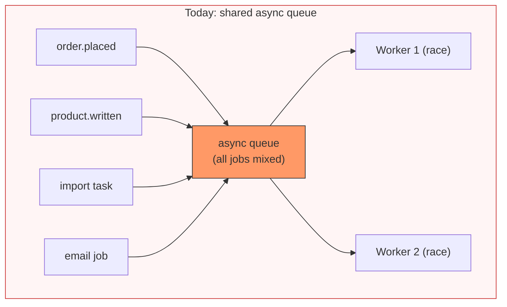
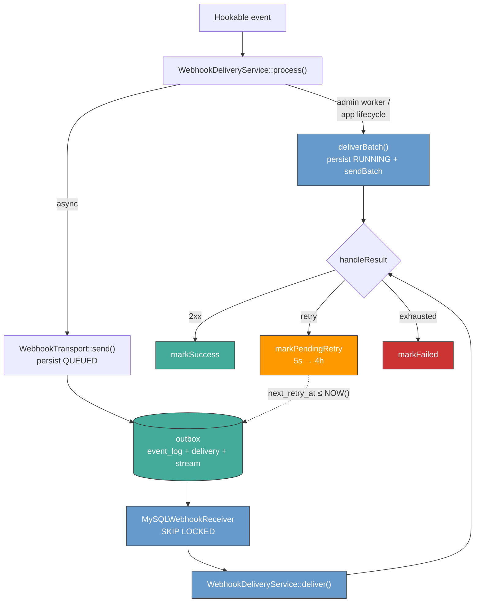
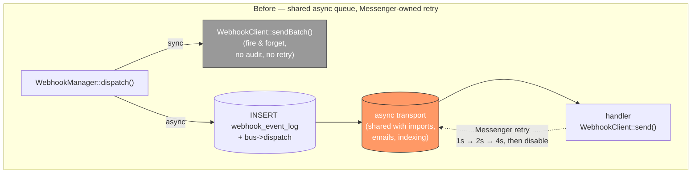
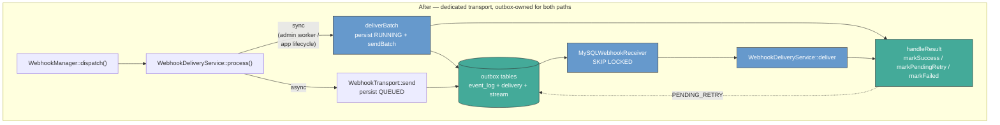
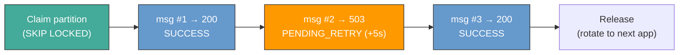
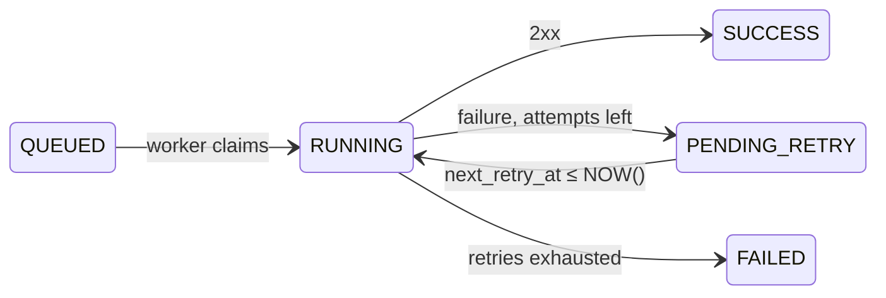
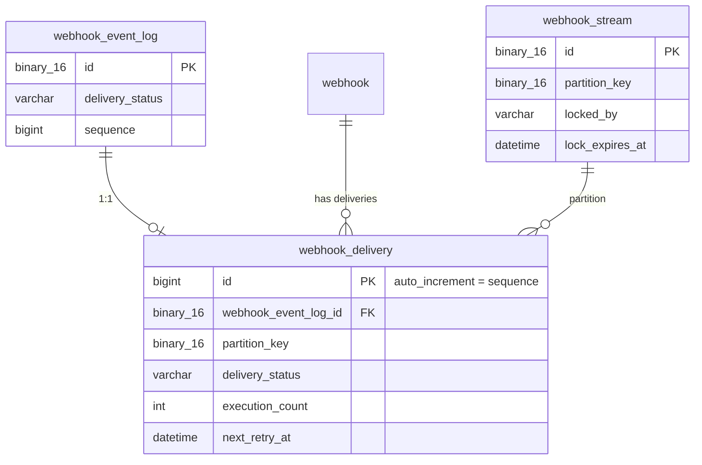

# Webhook outbox transport

::: info
This document represents an architecture decision record (ADR) and has been mirrored from the ADR section in our Shopware 6 repository.
You can find the original version [here](https://github.com/shopware/shopware/blob/trunk/adr/2026-04-14-webhook-outbox-transport.md)
:::

# Webhook outbox transport

## Context

Webhook delivery currently shares the general-purpose `async` Symfony Messenger transport with every other job in the platform — imports, mail, indexing. `WebhookEventMessage` implements `AsyncMessageInterface` and is routed alongside everything else. Retry is delegated to Messenger's transport-level strategy (`max_retries: 3`, `delay: 1000`, `multiplier: 2`), and a separate subscriber (`RetryWebhookMessageFailedSubscriber`) marks the event log on terminal failure and disables the webhook after 10 cumulative errors.

This has held up well in practice but introduces several structural gaps as webhook expectations grow:



| Problem | Root cause | Impact |
|:---|:---|:---|
| **No ordering guarantees** | Webhook messages share the `async` queue with all other platform work. Standard transports (Doctrine DBAL, Redis, AMQP) have no concept of message grouping or partitioning. With multiple workers, message pickup is a race. | `order.placed` can arrive after `order.paid`. No per-app isolation — all apps' events compete for the same workers. |
| **Retry lifecycle owned by the queue technology** | Messenger's transport-level retry can be tuned (`max_retries`, `delay`, `multiplier`) but the actual semantics — replay-on-failure, ordering of retried messages, visibility timeouts — depend on the queue backend (Doctrine, Redis, AMQP, SQS). Today the platform default is the 1s → 2s → 4s ladder (~7s total) on shared `async`. | Retry behaviour drifts between deployments. The webhook contract for app developers should not depend on which Messenger transport the shop has configured. |
| **Sync path has no audit trail** | `callWebhooksSynchronous()` uses a `GuzzleHttp\Pool` with fire-and-forget semantics — no `webhook_event_log` entry, no retry. | When `isAdminWorkerEnabled` is true, delivery failures are invisible and unrecoverable. |
| **Error counting is shared** | `RetryWebhookMessageFailedSubscriber` increments `error_count` only after Messenger retries are exhausted, and propagates increments and resets to all "related" webhooks (same `event_name + url + only_live_version`) via `RelatedWebhooks::updateRelated()`. At threshold (10), the webhook is disabled. | A single intermittently failing endpoint can disable webhooks for unrelated apps sharing the same event+URL. A success on one webhook also resets the counter for others. |
| **No recovery** | `disable_on_threshold` is a kill switch, not a circuit breaker. Once disabled, a webhook requires manual re-enablement. | Operators must intervene to restore delivery after transient outages. |

A core motivation is **delivery consistency across deployment topologies**. Shopware runs on MySQL-only stacks, managed SQS, RabbitMQ, and various hosting environments. Each transport has different retry semantics. The webhook contract with app developers should be the same regardless of which Messenger transport the shop has configured.

The existing infrastructure provides a foundation we can build on, not replace:

- **`webhook_event_log`** already persists events before async dispatch with a `delivery_status` field (queued → running → success/failed). It already operates as an application-level outbox, just without retry ownership.
- **`WebhookEventMessage`** carries the full delivery payload (URL, secret, headers, event data). Self-contained.
- **`RetryWebhookMessageFailedSubscriber`** proves the pattern of Shopware-owned failure handling layered on top of Messenger.

The work tracked under [shopware/shopware#16560](https://github.com/shopware/shopware/issues/16560) and merged via [#16692](https://github.com/shopware/shopware/pull/16692) is the Phase 1 implementation of this ADR.

## Decision

We implement webhook delivery as a dedicated Symfony Messenger transport (`shopware-webhook://`) backed by a MySQL application-level outbox with **best-effort FIFO** delivery per app. Phase 1 — the subject of this ADR — ships the transport foundation. Phase 2 and Phase 3 extend it with endpoint health and consumer tooling and are summarised at the end as roadmap.

### Phase 1 — what ships



The shipped behaviour:

- **Dedicated transport.** `WebhookEventMessage` routes to `shopware-webhook://default`; Messenger's transport-level retry is disabled — the outbox owns the lifecycle.
- **Outbox-first for both paths.** Sync (admin worker / app lifecycle) and async both persist the full outbox tuple before any HTTP call and converge on the same `handleResult` → `markSuccess` / `markPendingRetry` / `markFailed` transitions.
- **FIFO per app via stream leasing.** Workers claim a partition lease (`SKIP LOCKED` on `webhook_stream`), deliver in `webhook_delivery.id` order, rotate. HTTP runs outside the lock.
- **Shopware-owned retry.** Failures move to `PENDING_RETRY` with `next_retry_at`. Fixed schedule **5s → 30s → 5min → 30min → 4h**.
- **Crash-safe consumption.** Stale `RUNNING` rows are reset by the next partition claim. Workers can die mid-delivery without losing messages.
- **Consumer contract headers.** Rework envelopes carry `X-Shopware-Event-Id`, `X-Shopware-Sequence`, `X-Shopware-Attempt`.
- **Feature-flagged rollout.** Behind `WEBHOOKS_REWORK` (default off). Flag-off forwards to `async`, byte-identical to trunk; flag-on consumes from the outbox.
- **No runtime compatibility bridge.** Operators flipping the flag on must add `webhook` to their consume command (`messenger:consume webhook async ...`). A `ConsoleEvents::COMMAND` subscriber was prototyped to prepend `webhook` automatically but is not viable: `Command::run()` re-binds the input after the event fires, discarding the mutation.
- **Rollback drain command.** `bin/console webhook:drain-to-async` recovers non-terminal `webhook_delivery` rows that were left behind when the operator flips `WEBHOOKS_REWORK` off. It rewrites those rows back to `queued` in place (preserving `webhook_event_log.sequence`) and re-publishes them on the `async` Messenger transport, where the flag-off `WebhookEventMessageHandler` path delivers them. Refuses to run while the flag is active; safe alongside live traffic; at-least-once on re-run (consumer dedupes via `X-Shopware-Event-Id`).

The legacy `disable_on_threshold` behaviour is **retained as a stopgap** for Phase 1. The four-state health model that replaces it lands in Phase 2.

### Architecture, before and after





- **Both paths persist first.** Async writes `QUEUED` via `WebhookTransport::send`; sync writes `RUNNING` via `recordInflightOutboxEntry` so a concurrent receiver can't re-claim mid-flight.
- **One worker orchestrator.** `WebhookDeliveryService::deliver` owns `markRunning` + request build + send + `handleResult`. `deliverBatch` reaches the same `handleResult` after `sendBatch` returns.
- **Retries land back in the outbox.** No separate dead-letter queue, no Messenger retry stamps.

### Stream leasing for FIFO first attempts

A worker claims an exclusive lease on a partition (one per app by default), then delivers messages in insertion order. The HTTP call runs outside the database lock, so the lease is held only as long as delivery takes.



A single transient failure does **not** stall the partition. The failed message moves to `PENDING_RETRY` and the loop continues. Retries are picked up later when due — they may arrive after newer messages, breaking strict order. Consumers reconcile via `X-Shopware-Sequence`.

Leases are heartbeated during long HTTP calls and released on graceful shutdown. If a worker dies mid-delivery the row stays `RUNNING` until the next claim runs crash recovery, which moves it back to `PENDING_RETRY`.

### Outbox-owned retry

The retry queue is **the outbox itself**. There is no separate dead-letter queue, no Messenger retry stamps, no transport-specific retry behaviour. One mechanism, everywhere.
```
Attempt | Delay   | Cumulative
   1    |    5s   |      5s
   2    |   30s   |     35s
   3    |  5 min  |    ~5.5 min
   4    | 30 min  |    ~35 min
   5    |   4 h   |    ~4.5 h
```



### Consumer contract

Every webhook delivery carries metadata that lets app developers handle at-least-once delivery and out-of-order retries safely:

| Header | Purpose | Example |
|:---|:---|:---|
| `X-Shopware-Event-Id` | Deduplication. Stable across retries. **Sole** idempotency key. | `018f3a2b-…` |
| `X-Shopware-Sequence` | Monotonic counter for last-write-wins reordering of retries. | `48291` |
| `X-Shopware-Attempt` | 0-indexed attempt counter. Distinguishes first delivery from retries. **Not** part of the dedupe key. | `0`, `1`, `2` |

### Schema

Two new tables (`webhook_delivery`, `webhook_stream`) plus a `sequence` column on `webhook_event_log`:



- `webhook_delivery` — hot queue. Terminal rows deleted eagerly. `id` doubles as the global sequence.
- `webhook_event_log` — cold audit trail.
- `webhook_stream` — partition lease table for `SKIP LOCKED`.

Default partition key is `xxh128(app_name)` — one stream per app. Custom partition keys are Phase 2.

#### Sequence strategy — `AUTO_INCREMENT`

`webhook_delivery.id` is the global monotonic sequence. It maps cleanly onto the standard single-writer MySQL deployment and gives consumers a number to last-write-wins on. The trade-offs vs alternatives:

| Strategy | Monotonic | Multi-writer safe | Index width | Why not |
|:---|:---|:---|:---|:---|
| **`AUTO_INCREMENT` (chosen)** | Yes (single writer) | Bounded drift via `auto_increment_offset` | 8 B | — |
| Per-webhook atomic counter | Yes per webhook | Yes | 8 B | Per-webhook sequence space pushes complexity into the application: every insert needs to read-and-bump the counter under contention, and consumers have to track sequences per webhook instead of one global stream. |
| UUIDv7 | Approximate (ms granularity) | Yes | 16 B | Doubles secondary-index size; not strictly monotonic within a ms. |
| ULID | Approximate | Yes | 16 B | Same 16 B cost as UUIDv7. |
| Snowflake | Yes | Yes | 8 B | Requires a machine-id registry. |

On multi-writer topologies (Galera, Aurora Multi-Master) `auto_increment_increment`/`auto_increment_offset` avoid collisions but produce IDs that aren't globally monotonic in wall-clock order. In best-effort FIFO that affects happy-path ordering within a partition; consumers reconcile via sequence on their side. If true multi-writer support becomes a requirement, per-webhook counter is the recommended migration path.

### Code structure
```
src/Core/Framework/Webhook/
├── Transport/
│   ├── WebhookTransportFactory.php        # Creates the transport
│   ├── WebhookTransport.php               # send() persists; receiver poll consumes
│   └── MySQLWebhookReceiver.php           # SKIP LOCKED + KeepaliveReceiverInterface
├── Outbox/
│   ├── WebhookOutboxStore.php             # Outbox CRUD, retry transitions, sequence
│   ├── StreamLockService.php              # Partition claim / heartbeat / release
│   ├── RetryDelayCalculator.php           # Fixed schedule 5s → 4h
│   ├── DeliveryResponse.php               # HTTP request/response capture
│   ├── OutboxEntry.php                    # DTO
│   ├── OutboxInsert.php                   # DTO
│   └── StreamLease.php                    # DTO
├── Service/
│   ├── WebhookDeliveryService.php         # Unified HTTP dispatch
│   ├── WebhookHealthService.php           # Phase 2 entry point (scaffolded)
│   ├── WebhookManager.php                 # Outbox-first for both paths
│   ├── WebhookClient.php                  # Guzzle wrapper with HMAC signing
│   └── WebhookCleanup.php                 # Extended for delivery + stream cleanup
├── Handler/
│   └── WebhookEventMessageHandler.php     # Refactored: delegates to WebhookDeliveryService
└── Message/
    └── WebhookEventMessage.php            # Existing, minor extensions
```

### Migration of in-flight messages

When the transport flag is enabled, `WebhookEventMessage` instances may already be queued in the `async` Doctrine transport. The migration is gradual:

1. `WebhookEventMessageHandler` is registered for both `async` and the new `webhook` transport during the transition.
2. Existing `async` rows drain normally. The handler detects the absence of an outbox entry and processes them in legacy mode.
3. Once `async` is drained of webhook messages, the legacy routing is removed.

There is no flag-day cut-over and no message loss.

## Trade-offs

The cross-cutting architectural trade-offs:

### Best-effort FIFO vs strict FIFO vs no ordering

| Approach | Ordering | Availability | Why not chosen |
|:---|:---|:---|:---|
| **Strict FIFO** | Guaranteed | Head-of-line blocking | One failing event blocks all subsequent events in the partition. |
| **No ordering** | None | Maximum throughput | Workers race for any message — identical to the default Doctrine transport. No per-app isolation. |
| **Best-effort FIFO (this ADR)** | Insertion order on the happy path; retries break order | Always progresses | Throughput scales with partition count; consumers must reorder via `X-Shopware-Sequence`. |

### Application-level outbox vs true transactional outbox

A true transactional outbox writes the outbox entry inside the same DB transaction as the business write, so the two commit atomically. This ADR ships an **application-level** outbox: the webhook layer owns the outbox table, and the entry is written from the event dispatcher after the business write commits.

The distinction:

- **True transactional outbox** — DAL owns the outbox; one commit covers business state + outbox entry. Tightest coupling, no event loss on crash.
- **Application-level outbox (chosen)** — webhook layer owns the outbox; decoupled from DAL via the event dispatcher. Fits Shopware's dispatch-after-commit model and the extension architecture. The accepted trade-off is that a process crash strictly between the business commit and the outbox write would lose the event.

### Dedicated MySQL transport vs reusing existing infrastructure

| Alternative | How it works | Why not chosen |
|:---|:---|:---|
| **Messenger middleware** | Intercept dispatch in middleware to write the outbox entry. | Cannot own the receive side. Splits persistence across middleware + a separate receiver. |
| **Outbox-then-dispatch poller** | Separate scheduled task moves outbox entries into the queue. | Adds polling latency, requires a second process, reintroduces the ordering problem. |
| **External FIFO only (SQS / Kafka)** | Use an external FIFO broker for everything. | Retry semantics differ per broker (visibility timeouts, redrive, replay). Building one consistent retry contract on top of N brokers is what we're trying to avoid — retries would have to be re-implemented per transport. Requires infrastructure not available on typical self-hosted shops. |
| **Custom transport (chosen)** | The transport IS the outbox. Sender persists, receiver polls via stream leasing. | Native Messenger lifecycle. One retry path. Works on every deployment. |

## Implications for app developers

Webhook consumers should be designed for:

- **At-least-once delivery.** The same event may be delivered multiple times (retries, crash recovery, future probing). Deduplicate by `X-Shopware-Event-Id` only — it is unique per event and stable across retries.
- **Best-effort ordering.** Within a partition (one per app by default), first-attempt delivery is in insertion order. If A fails and retries, B and C still deliver. When A's retry arrives it may be after B and C — use `X-Shopware-Sequence` for last-write-wins reordering.
- **Sequence gaps.** Sequence numbers are global across all webhooks, not per-webhook. Gaps from interleaving are normal and not a sign of loss.
- **Retry attempts.** `X-Shopware-Attempt` is 0-indexed and changes on each delivery attempt. It is not stable across retries and must not be part of a dedupe key.

## Consequences

### Positive

- **Webhooks no longer share the platform queue.** A dedicated transport isolates webhook delivery from imports, mail, and indexing — no worker contention, no head-of-line blocking from unrelated jobs.
- **Retry behaviour is owned by Shopware, not the queue backend.** The outbox drives retry timing (5s → 4h) so the contract for app developers is identical on MySQL, Redis, AMQP, or SQS deployments instead of varying with whichever Messenger transport the shop has configured.
- **Worker-path deliveries are auditable.** Two-stage persistence (`webhook_event_log` + `webhook_delivery`) lands before any HTTP attempt, with HTTP happening outside the database lock.
- **Stream-leased FIFO** removes the worker race condition for first attempts within an app.
- **One worker orchestrator.** The worker path goes through a single `WebhookDeliveryService::deliver()` (request build, send, result handling).
- **Standard worker invocation.** `messenger:consume webhook async` — no separate daemon, no custom CLI command.
- **Rollback is trivial.** Flip `WEBHOOKS_REWORK` off and the transport forwards to `async` exactly as in trunk.

### Negative / trade-offs

- **A custom Messenger transport is non-trivial to own.** `WebhookTransport`, `MySQLWebhookReceiver`, stream leasing, crash recovery, keepalive, lease rotation — all of it has to be maintained in-tree alongside Symfony Messenger upgrades. This is the main cost of the design: we trade a shared, generic transport for one that fits the webhook contract exactly.
- **Application-level outbox, not transactional.** A process crash strictly between the business commit and the outbox write would lose the event.
- **Two new tables** (`webhook_delivery`, `webhook_stream`) to operate and monitor.

### Deferred / out of scope

- **Endpoint health (DEGRADED / SUSPENDED / DISABLED with auto-probe and heartbeat recovery)** — Phase 2.
- **Error classification (transient vs non-transient)** and per-error backoff tuning — Phase 2.
- **Custom partition keys via `PartitionAwareHookable`** — Phase 2.
- **Replay API for failed events, batch delivery, JSON payload migration** — Phase 3.
- **External FIFO broker (SQS FIFO, Kafka) for first attempts** — Phase 3.

## Roadmap

Phase 2 and Phase 3 are sketched here as direction, not commitments. Details may change during implementation. Each will get its own ADR.

**Phase 2 — Endpoint health & smart retry.** Four-state per-webhook circuit breaker (HEALTHY → DEGRADED → SUSPENDED → DISABLED), `ErrorClassifier` (transient vs non-transient), tuned per-error backoff, removal of the shared `error_count`, custom partition keys, weekly heartbeat-driven recovery from SUSPENDED. Replaces `disable_on_threshold` and the `RelatedWebhooks` propagation.

**Phase 3 — Consumer tooling & broker flexibility.** Replay API for FAILED events, parallel delivery across partitions via `GuzzlePool`, opt-in same-destination batching (webhook API v2), JSON payload migration, optional external FIFO broker (SQS / Kafka) for first attempts with the outbox always handling retries.
