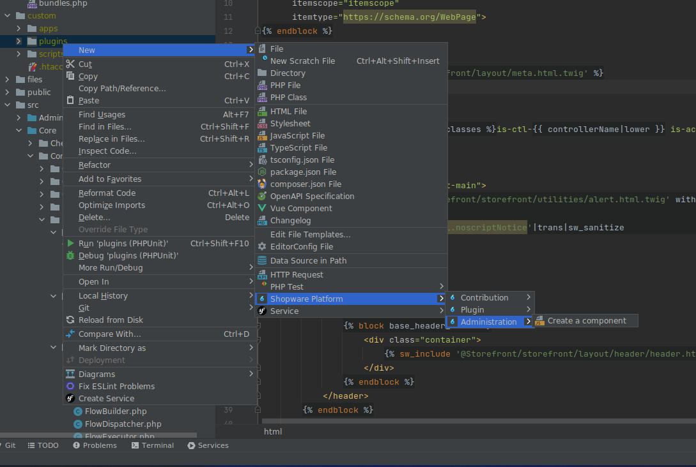

---
nav:
  title: Shopware Toolbox
  position: 10

---

# Shopware 6 Toolbox

Shopware 6 Toolbox is a helper plugin and productivity tool for common tasks for Shopware 6 development. It adds some live templates and scaffolding of common Shopware files.

## Current features

### Live templates

Multiple live templates for development. Use Cmd/Ctrl + J to see all live templates available.

### Generators

* Vue.js Admin component
* config.xml
* Extend Storefront blocks with automatic file creation
* Vue module
* Scheduled task
* Changelog

### Static code check

Inspection to show an error when abstract class is used incorrectly in the constructor (guideline check).

### Auto-completion

* Admin components
* Snippets in Administration and Storefront
* Storefront functions `theme_config`, `config`, `seoUrl`, `sw_include` and `sw_extends`
* Repositories at this.repositoryFactory.create
* Module.register labels
* Show only admin component auto-completion when the twig file is next to an index.js
* Feature flags

## Installation

Either search for `Shopware 6 Toolbox` in the JetBrains Marketplace or get it on the marketplace website.

<PageRef page="https://plugins.jetbrains.com/plugin/17632-shopware-6-toolbox" title="Shopware 6 Toolbox on JetBrains Marketplace" target="_blank" />
